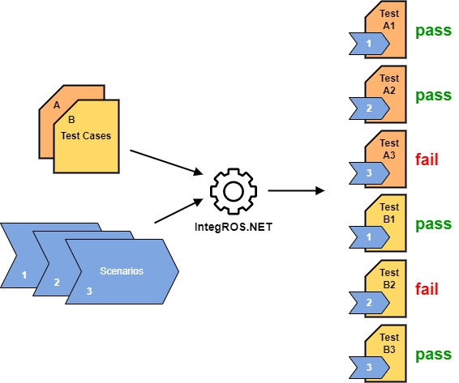

# IntegROS.NET

Verify your expectations on [ROS](https://ros.org) applications in a more natural way.

```c#
[ExpectThat]
public void My_Expectations_are_met()
{
    Scenario
        .Messages
        .InTypic("/*")
        .Should()
        .MeetMyExpectation();
}
```

## Concept

As in traditional ROS (unit) testing frameworks you declare test classes and test methods. \
But in contrast to traditional testing frameworks you don't interact with the ROS application itself (publish messages, call actions or services) in the test methods.
These interactions are encapsulated in *scenarios* that are executed outside of your tests. 
The ROS messages published during execution are recorded and injected as *ROS message stream* into your test classes.
This allows you to state many tests for a single scenario without the need to execute it for each test.

In your test you only look at the flow of ROS message and verify, that the ROS network behaves as you would expect it.



### How it works

1) Define your expectations about the behavior of a ROS application in test methods.
2) Assign scenarios to expectations.
3) Run your tests.


## Test class

All expectations are encapsulated in test methods, which are part of test classes.
A test class extends the IntegROS.NET base class `ForScenario`.
This base class gives you access to the ROS message stream of your scenarios.

Scenarios are defined with attributes on the class or method level (more on that later).

```c#
[RosbagScenario(BagFiles.PathToROSBAG))]
public class MyTestClass : ForScenario
{
    [ExpectThat]
    public void Test_method_1()
    {
       // ...
    }
    
    [ExpectThat]
    public void Test_method_2()
    {
       // ...
    }
}
```


## Test method

A test method represents an expectation and is annotated with `[ExpectThat]`.
This attribute allows IntegROS.NET to recognize your method as an executable test method.

```c#
[ExpectThat]
public void My_fisrt_test()
{
    // Access to the ROS message stream.
    var allRosMessages = Scenario.Messages;
    
    // 1) Filter the message stream
    // ...
    // 2) Verify your expectation
    // ...
}
```

You have access to the ROS message stream with the `Scenario.Messages` property.

The test method itself has to parts:
1. [**Filter** the ROS message stream](filter.md)
2. [**Verify** your expectation](verify.md)

Follow the links above to see how it works.

You can skip test case execution by setting the `Skip` property on the `[ExpectThat]` attribute.


## Assign scenarios

As mentioned before, scenarios are injected from outside with special attributes on the class or method level.

We provide a `[RosbagScenario]` attribute, which allows you to define prerecorded scenario wit a path to a ROSBAG file.

* If you define the scenario attribute at a class, the scenario is verified against all test methods in the class.
* If you define the scenario attribute at a method, the scenario is verified only against that method.
* You can define multiple scenario attributes on the same class or method to verify multiple scenarios.
* You can mix attributes at class and method level.
* You can skip some scenarios by setting the `Skip` property of a scenario attribute.

```c#
[RosbagScenario(BagFiles.PathToROSBAG))]
public class MyTestClass : ForScenario
{
    [ExpectThat]
    public void Test_method_1()
    {
       // ...
    }
}
```

```c#
public class MyTestClass : ForScenario
{
    [RosbagScenario(BagFiles.PathToROSBAG_1))]
    [ExpectThat]
    public void Test_method_1()
    {
       // ...
    }
    
    [RosbagScenario(BagFiles.PathToROSBAG_2))]
    [ExpectThat]
    public void Test_method_2()
    {
       // ...
    }
}
```

## Run your tests

Execute test suite to verify your expectations:

```
dotnet test
```